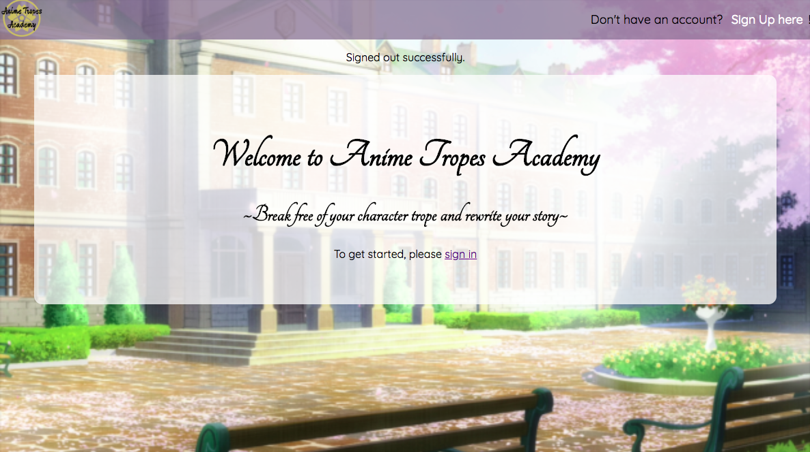
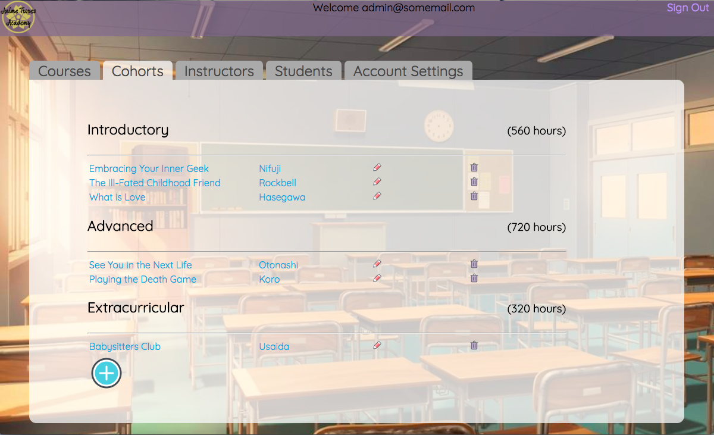
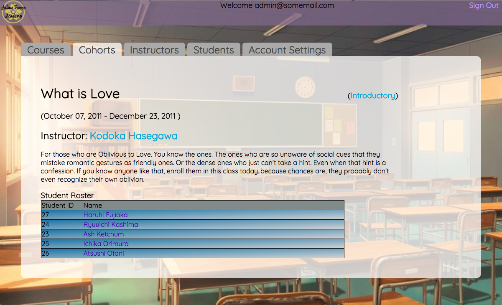

# Anime Tropes Academy Admin Panel

## Goal
To create an admin panel for a fictitious school whereby the administrator can create users and complete common administrative tasks.

## Summary
This website is designed for administrators of a (fictitious) school, thus all users have the same accesss and are able to add, edit, view, and delete courses, cohorts, instructors, and students.

## Deployment
Deployed to Heroku at https://protected-beach-23099.herokuapp.com/

#### Login
*Username*: admin@somemail.com  
*Password*: 123123

## Built Using
* Ruby on Rails
* ActiveRecord
* PostgreSQL
* Devise (https://github.com/plataformatec/devise)
* Tabulous (https://github.com/techiferous/tabulous)
* HTML
* SCSS
* JavaScript
